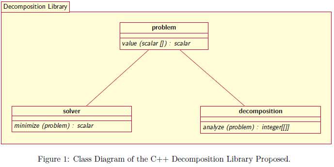

# Decomposition C++ Library

## Description
This project is a decomposition C++ library for continuous optimization problems.

## Computational Architecture

### Requirements
C++ 17

Cmake - Minimal Version 3.9

### Class Diagram


## Static Decomposition Methods
- Differential Grouping (DG) [1]
- Differential Grouping 2 (DG2) [2]
- Extended Differential Grouping (XGD) [3]
- Fast Interdependency Identification (FII) [4]
- Global Differential Grouping (GDG) [5]
- Recursive Differential Grouping (RDG) [6]
- Recursive Differential Grouping 2 (RDG2) [7]
- Recursive Differential Grouping 1 (RDG3) [8]


## Examples

For very quick complete examples, see the directory [examples](/examples).

#### Implementing an Optimization Problem

The code below presents an optimization problem example:

```cpp
#include "problem.h"

using namespace decompose;

class problem_example_1 : public problem {
public:
    using super = problem;

public:
    explicit problem_example_1(size_t dim, vector<scalar> lower_bound, vector<scalar> upper_bound) : super(dim, std::move(lower_bound), std::move(upper_bound)) {}

    scalar value(const vector<scalar> &x) override {
        scalar sum = 0.0;
        for(scalar x_i : x){
            sum += x_i * x_i;
        }
        return sum;
    }
};
```


#### Executing an Decomposition Method:

The code below presents an example of the Differential Grouping for the optimization problem previously presented:

```cpp
#include "problem.h"
#include "differential_grouping_method.h"

using namespace decompose;

int main(){
    const size_t dim = 10;
    const scalar lower_bound = -5.0;
    const scalar upper_bound = 10.0;

    vector<set<size_t>> sub_problems;
    size_t number_seps, number_non_seps;
    string structure;

    problem_example f(dim, vector<scalar>(dim, lower_bound), vector<scalar>(dim, upper_bound));

    criteria criteria_;
    options options_ = options::defaults();
    differential_grouping_method method;
    method.analyze(f, options_, criteria_);

    cout << "Differential Grouping Method Example - Default Parameter" << endl;

    sub_problems = f.get_problem_structure();
    cout << " - Number of Function Evaluations: " << criteria_.evaluations << endl;
    number_seps = 0;
    number_non_seps = 0;
    for(auto & sub_problem : sub_problems){
        if(sub_problem.size() > 1){
            number_non_seps += sub_problem.size();
        }
        else{
            number_seps++;
        }
    }
    cout << " - Number of sub-problems found: " << sub_problems.size() << endl;
    cout << " - Number of separable decision variables: " << number_seps  << endl;
    cout << " - Number of non-separable decision variables: " << number_non_seps  << endl;
    structure = f.print_sub_problem_structure();
    cout << " - Problem Structure Found: " << structure << endl;
    cout << endl << endl;

    return 0.0;
}
```

## References
[1] M. N. Omidvar, X. Li, Y. Mei and X. Yao, Cooperative Co-Evolution With Differential Grouping for Large Scale Optimization, in IEEE Transactions on Evolutionary Computation, vol. 18, no. 3, pp. 378-393, June 2014, doi: 10.1109/TEVC.2013.2281543.

[2] M. N. Omidvar, M. Yang, Y. Mei, X. Li and X. Yao, DG2: A Faster and More Accurate Differential Grouping for Large-Scale Black-Box Optimization, in IEEE Transactions on Evolutionary Computation, vol. 21, no. 6, pp. 929-942, Dec. 2017, doi: 10.1109/TEVC.2017.2694221.

[3] Yuan Sun, Michael Kirley, and Saman Kumara Halgamuge. 2015. Extended Differential Grouping for Large Scale Global Optimization with Direct and Indirect Variable Interactions. In Proceedings of the 2015 Annual Conference on Genetic and Evolutionary Computation (GECCO '15). Association for Computing Machinery, New York, NY, USA, 313–320. DOI: doi.org/10.1145/2739480.2754666

[4] Xiao-Min Hu, Fei-Long He, Wei-Neng Chen, Jun Zhang, Cooperation coevolution with fast interdependency identification for large scale optimization, Information Sciences, Volume 381, 2017, Pages 142-160.

[5] Yi Mei, Mohammad Nabi Omidvar, Xiaodong Li, and Xin Yao. 2016. A Competitive Divide-and-Conquer Algorithm for Unconstrained Large-Scale Black-Box Optimization. ACM Trans. Math. Softw. 42, 2, Article 13 (June 2016), 24 pages. DOI: doi.org/10.1145/2791291

[6] Y. Sun, M. Kirley and S. K. Halgamuge, "A Recursive Decomposition Method for Large Scale Continuous Optimization," in IEEE Transactions on Evolutionary Computation, vol. 22, no. 5, pp. 647-661, Oct. 2018, doi: 10.1109/TEVC.2017.2778089.

[7] Yuan Sun, Mohammad Nabi Omidvar, Michael Kirley, and Xiaodong Li. 2018. Adaptive threshold parameter estimation with recursive differential grouping for problem decomposition. In <i>Proceedings of the Genetic and Evolutionary Computation Conference</i> (<i>GECCO '18</i>). Association for Computing Machinery, New York, NY, USA, 889–896. DOI: doi.org/10.1145/3205455.3205483

[8] Y. Sun, X. Li, A. Ernst and M. N. Omidvar, "Decomposition for Large-scale Optimization Problems with Overlapping Components," 2019 IEEE Congress on Evolutionary Computation (CEC), Wellington, New Zealand, 2019, pp. 326-333, doi: 10.1109/CEC.2019.8790204.

[9] Virtual Library of Simulation Experiments. Test Functions and Datasets - Sphere Function. Access 08-11-2020. (2020) 
